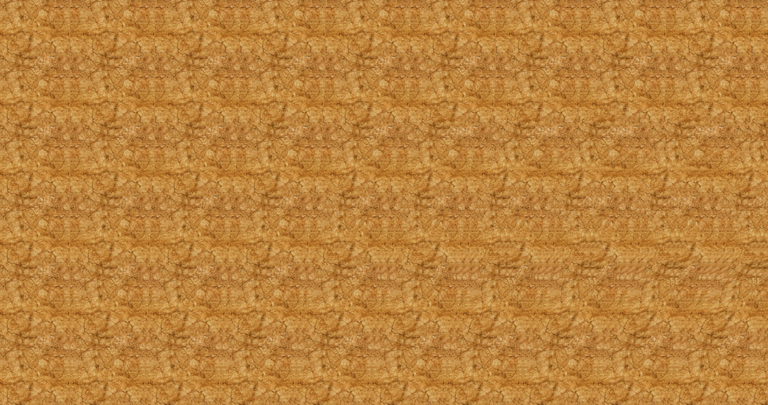
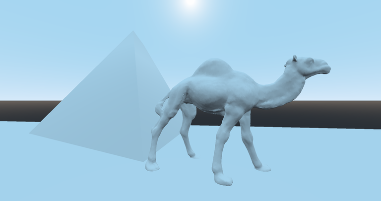
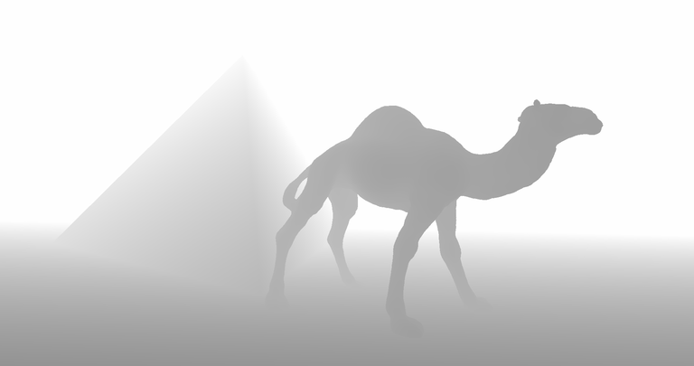
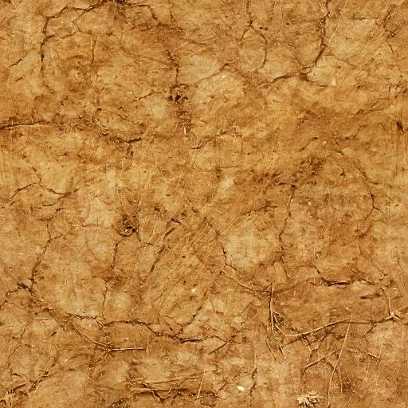

Postprocessing shader for Godot to generate autostereograms of 3D scenes. Based loosely on the NVIDIA GPUGems https://developer.nvidia.com/gpugems/gpugems/part-vi-beyond-triangles/chapter-41-real-time-stereograms

### Usage

Import the project into Godot (I am using 3.2). Add some 3D models into the models/ directory, and click and drag them into the main scene. StageBox shows roughly the bounds of what the camera will see, so you may need to shrink or enlarge models to be the right size. You can change the texture being used by clicking on the "Autostereogram" node in the scene tree, clicking on "Material" in the inspector (right hand side of screen), clicking to expand "Shader Param", and dragging a new texture onto the "Image" field.

Once it's all set up, just press play! SPACEBAR to take screenshots, which will show up in the "screenshots" directory, and TAB will cycle through the raw scene, the depth scene, and the autostereogram.

Raw scene:

Rendered as depth:

Crossed with a seamless texture:

Instantly becomes a autostereogram!

### Samples

Check out more samples [here](https://github.com/voxibit/godot-autostereogram/tree/main/models) or [here](https://imgur.com/gallery/FempJmU)

